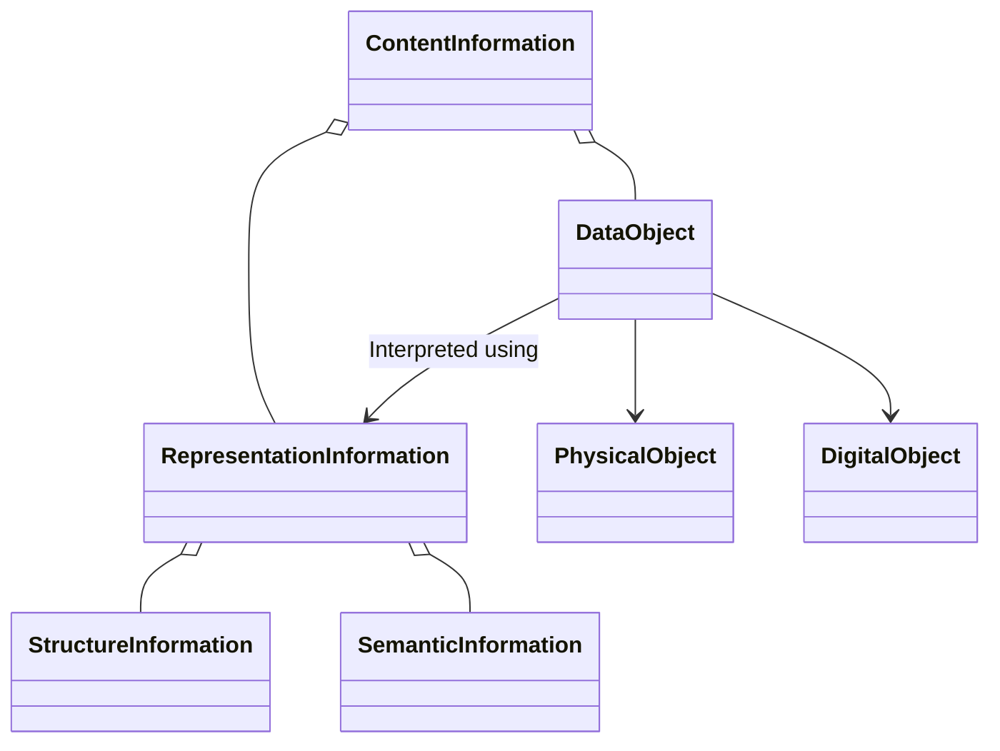
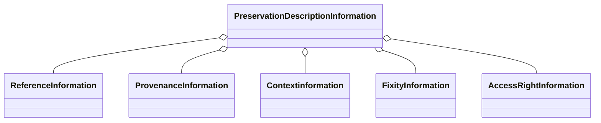

## OAIS docu: https://public.ccsds.org/pubs/650x0m2.pdf

```mermaid
classDiagram
      Content Information o-- Data Object
      Content Information o-- Representation Information
      Data Object -->  Representation Information: Interpreted using
      Data Object --> Physical Object
      Data Object --> Digital Object
      Representation Information o-- Structure Information
      Representation Information o-- Semantic Information
```
----------------------------

```mermaid
classDiagram
     PreservationDescriptionInformation o-- Reference Information
      PreservationDescriptionInformation o-- Provenance Information
      PreservationDescriptionInformation o-- Context information
      PreservationDescriptionInformation o-- Fixity Information
      PreservationDescriptionInformation o-- Access Right Information
```
